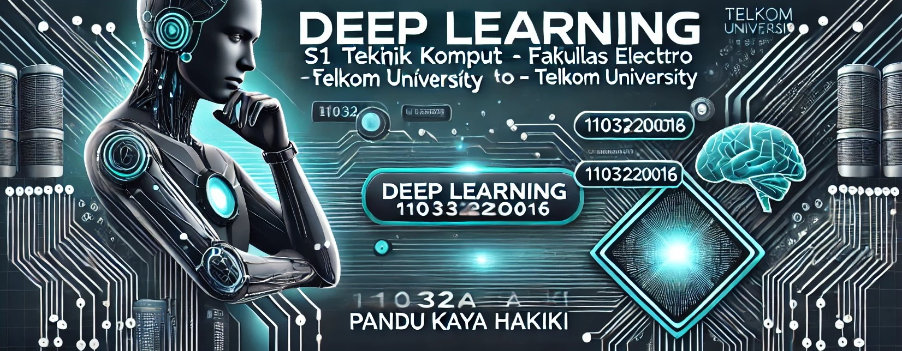

# Deep Learning - Tugas Peminatan

## 📚 Deskripsi
Repository ini berisi **tugas Peminatan Deep Learning** untuk Semester Genap 2025, yang diambil oleh mahasiswa **S1 Teknik Komputer**, Fakultas Teknik Elektro, **Telkom University**. Tugas ini disusun oleh **Pandu Kaya Hakiki** (NIM: 1103220016) dari Kelas **TK-45-G13**.

Dokumen dan kode yang ada di repository ini dapat digunakan untuk **referensi** dan **pembelajaran ulang**, dengan penjelasan terperinci mengenai konsep, algoritma, dan implementasi terkait Deep Learning.
